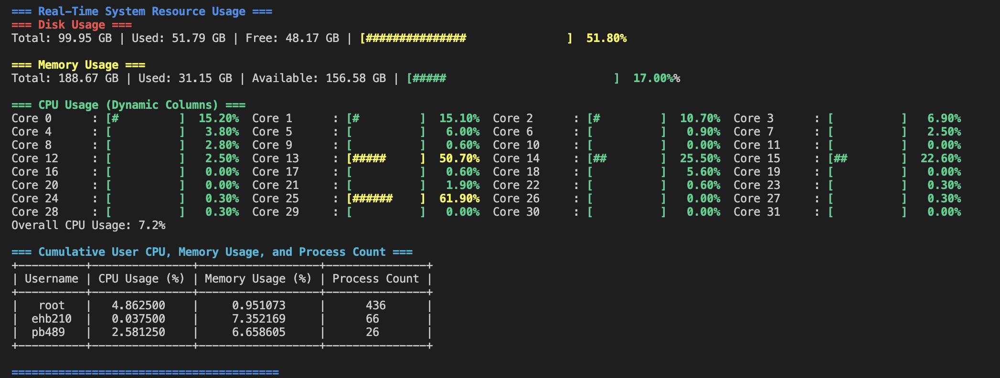

# acctop

A python-enhanced replacement for the 'top' inbuild linux command, for usage on servers: vergi, stratus, cumulus, nimbus

## Installation

To install the command, there are two options:

### Option 1

This installs the command globally, by putting it in your `~/.bin` directory.

```[bash]
./build_all.sh
```

This will build the tool, move it to `~/.bin` (or create this directory if it doesn't exist), and add `~/.bin` to your `PATH`.

### Option 2

This creates the executable `acctop` in the `dist` directory.
You will need to handle moving this to a directory on your `PATH`, or just always execute in-place.

## Usage

To run the acctop tool, use the following command (from anywhere if you have installed globally):

```[bash]
acctop
```

### Command-Line Options

- `acctop`: this will display basic cpu and memory display.
- `acctop --interval X`: this can be used to change the default update interval. Change X to the number of seconds between updates desired.
- `acctop --show-network`: this will show network info.
- `acctop --show-load`: this will show network load info.
- `acctop --show-system`: this will show system info.
- `acctop --show-all`: this will show all info.

### Example Output



## Warnings

This tool will append to your `.bashrc` and `.zshrc` shells if they exist.
The shell `.zshrc` will take priority and be reloaded last.

You may need to append the following line if you are using an alternative shell:

```[text]
export PATH="$PATH:$HOME/.bin"
```

Then reload your shell.
